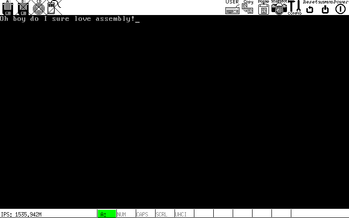

# Writing a Tiny x86 Bootloader

December 27, 2016

All the code/files from this post are available on my Github.

Edit: After some discussion by the good people on Hacker News, it's become clear that when in 16-bit real mode, it's best to use 2-byte registers bp, sp, instead of the 4-byte esb, esp. The article and code have been updated to reflect this.

It might be from being stuck at home with nothing to do over break, or it might be from an actual interest in low-level systems design, but I've taken it upon myself to learn more about OS implementation, starting with the bootloader. So, here we go. All of this information exists in various other places on the web, but there's no better way to learn than by teaching, right? Either way, this piece should serve as primer on what exactly a bootloader does and how to implement a relatively simple one (compared to a beast like GRUB which is ostensibly its own little operating system).

## What is a bootloader?

When a computer boots up, the job of getting from nothing to a functioning operating system involves a number of steps. The first thing that happens on an x86 PC is the operation of the BIOS. We'll eschew the discussion of the intricacies of how the BIOS works, but here's what you need to know. When you turn your computer on, the processor immediately looks at physical address 0xFFFFFFF0 for the BIOS code, which is generally on some read-only piece of ROM somewhere in your computer. The BIOS then POSTs, and searches for acceptable boot media. The BIOS accepts some medium as an acceptable boot device if its boot sector, the first 512 bytes of the disk are readable and end in the exact bytes 0x55AA, which constitutes the boot signature for the medium. If the BIOS deems some drive bootable, then it loads the first 512 bytes of the drive into memory address 0x007C00, and transfers program control to this address with a jump instruction to the processor.

Most modern BIOS programs are pretty robust, for example, if the BIOS recognizes several drives with appropriate boot sectors, it will boot from the one with the highest pre-assigned priority; which is exactly why most computers default to booting from USB rather than hard disk if a bootable USB drive is inserted on boot.

Typically, the role of the boot sector code is to load a larger, "real" operating system stored somewhere else on non-volatile memory. In actuality, this is a multi-step process. For example, Master Boot Record, or MBR, is a very common (though now becoming more and more deprecated) boot sector standard for partioned storage devices. Since the boot sector may contain a maximum of 512 bytes of data, an MBR bootloader often simply does the job of passing control to a different, larger bootloader stored somewhere else on disk, whose job in turn is to actually load the operating system (chain-loading). Right now, though, we won't concern ourselves with all this; the goal here isn't to write an operating system (saving that one for another post), but just to get the computer to spit something out onto the screen of our choosing.

It's also important to note that the execution is passed over to bootstrap code while the processor is in real mode, rather than protected mode, which means that (among other things,) access to all of those great features of operating systems that you know and love is out the window. On the other hand, it means that we can directly access the BIOS interrupt calls, which offer some neat low-level functionality.

So, where to begin? I decided to use NASM, a pretty ubiquitous flavor of assembly, for this project. As far as testing goes, it's very much possible to just dd the compiled assembly onto the first 512 bytes of a USB drive and boot the computer from that, but that doesn't have a very fast turnaround, no? Bochs is a neat little x86 IBM-PC compatible emulator which has a bunch of useful features; we'll use this for testing.

## Getting Started

Go ahead and download the NASM compiler and Bochs. I use Arch, so pacman is my package manager.

```bash
sudo pacman -S nasm bochs
```

Just for fun, let's start by writing a little stack for our bootloader to use. x86 processors have a number of segment registers, which are used to store the beggining of a 64k segment of memory. In real mode, memory is addressed using a logical address, rather than the physical address. The logical address of a piece of memory consists of the 64k segment it resides in, as well as its offset from the beginning of that segment. The 64k segment of a logical address should be divided by 16, so, given a logical address beginning at 64k segment A, with offset B, the reconstructed physical address would be A*0x10 + B.

For example, the processor has a DS register for the data segment. Since our code resides at 0x7C00, the data segment may begin at 0x7C0, which we can set with

```bash
mov ax, 0x7C0
mov ds, ax
```

We have to load the segment into another register (here it's ax) first; we can't directly stick it in the segment register. Let's start the storage for the stack directly after the 512 bytes of the bootloader. Since the bootloader extends from 0x7C00 for 512 bytes to 0x7E00, the stack segment, SS, will be 0x7E0.

```bash
mov ax, 0x7E0
mov ss, ax
```

On x86 architectures, the stack pointer decreases, so we must set the initial stack pointer to a number of bytes past the stack segment equal to the desired size of the stack. Since the stack segment can address 64k of memory, let's make an 8k stack, by setting SP to 0x2000.

```bash
mov sp, 0x2000
```

We're now free to use the standard calling convention in order to safely pass control over to different functions. We can use push in order to push caller-saved registers on to the stack, pass parameters to the callee again with push, and then use call to save the current program counter to the stack, and perform an unconditional jump to the given label.

Alright, now that all that is out of the way, let's figure out a way to clear the screen, move the pointer, and write some text. This is where real mode and BIOS interrupt calls come in to play. By storing certain registers with certain parameters and then sending a particular opcode to the BIOS as an interrupt, we can do a bunch of cool stuff. For example, by storing 0x07 in the AH register and sending interrupt code 0x10 to the BIOS, we can scroll the window down by a number of rows. See the spec here. Note that the registers AH and AL refer to the most and least significant bytes of the 16 bit register AX. Thus, we could effectively update both their values at once by simply pushing a 16 bit value to AX, however, we'll opt for the clearer approach of updating each 1-byte subregister at a time.

If you look at the spec, you'll see that we need to set AH to 0x07, and AL to 0x00. the value of register BH refers to the BIOS color attribute, which for our purposes will be black background (0x0) behind light-gray (0x7) text, so we must set BH to 0x07. Registers CX and DX refer to the subsection of the screen that we want to clear. The standard number of character rows/cols here is 25/80, so we set CH and CL to 0x00 to set (0,0) as the top left of the screen to clear, and DH as 0x18 = 24, DL as 0x4f = 79. Putting this all together in a function, we get the following snippet.

```bash
clearscreen:
    push bp
    mov bp, sp
    pusha

    mov ah, 0x07        ; tells BIOS to scroll down window
    mov al, 0x00        ; clear entire window
    mov bh, 0x07            ; white on black
    mov cx, 0x00        ; specifies top left of screen as (0,0)
    mov dh, 0x18        ; 18h = 24 rows of chars
    mov dl, 0x4f        ; 4fh = 79 cols of chars
    int 0x10        ; calls video interrupt

    popa
    mov sp, bp
    pop bp
    ret
```

The overhead at the beginning and end of the subroutine allows us to adhere to the standard calling convention between caller and callee. pusha and popa push and pop all general registers on and off the stack. We save the caller's base pointer (4 bytes), and update the base pointer with the new stack pointer. At the very end, we essentially mirror this process.

Nice. Now let's write a subroutine for moving the cursor to an arbitrary (row,col) position on the screen. Int 10/AH=02h does this nicely. This subroutine will be slightly different, since we'll need to pass it an argument. According to the spec, we must set register DX to a two byte value, the first representing the desired row, and second the desired column. AH has gotta be 0x02, BH represents the page number we want to move the cursor to. This parameter has to do with the fact that the BIOS allows you to draw to off-screen pages, in order to facilitate smoother visual transitions by rendering off-screen content before it is shown to the user. This is called multiple or double buffering. We don't really care about this, however, so we'll just use the default page of 0.

Putting it all together, we have the following subroutine.

```bash
movecursor:
    push bp
    mov bp, sp
    pusha

    mov dx, [bp+4]      ; get the argument from the stack. |bp| = 2, |arg| = 2
    mov ah, 0x02        ; set cursor position
    mov bh, 0x00        ; page 0 - doesn't matter, we're not using double-buffering
    int 0x10

    popa
    mov sp, bp
    pop bp
    ret
```

The only thing that might look unusual is the mov dx, [bp+4]. This moves the argument we passed into the DX register. The reason we offset by 4 is that the contents of bp takes up 2 bytes on the stack, and the argument takes up two bytes, so we have to offset a total of 4 bytes from the actual address of bp. Note also that the caller has the responsibility to clean the stack after the callee returns, which amounts to removing the arguments from the top of the stack by moving the stack pointer.

The final subroutine we want to write is simply one that, given a pointer to the beginning of a string, prints that string to the screen beginning at the current cursor position. Using the video interrupt code with AH=0Eh works nicely. First off, we can define some data and store a pointer to its starting address with something that looks like this.

```bash
msg:    db "Oh boy do I sure love assembly!", 0
```

The 0 at the end terminates the string with a null character, so we'll know when the string is done. We can reference the address of this string with msg. Then, the rest is pretty much like what we just saw with movecursor. We use some more labels and a conditional jump, but at risk of being too verbose, understanding the code is left as an excercise to the reader ;).

```bash
print:
    push bp
    mov bp, sp
    pusha
    mov si, [bp+4]      ; grab the pointer to the data
    mov bh, 0x00        ; page number, 0 again
    mov bl, 0x00        ; foreground color, irrelevant - in text mode
    mov ah, 0x0E        ; print character to TTY
.char:
    mov al, [si]        ; get the current char from our pointer position
    add si, 1       ; keep incrementing si until we see a null char
    or al, 0
    je .return          ; end if the string is done
    int 0x10            ; print the character if we're not done
    jmp .char       ; keep looping
.return:
     popa
     mov sp, bp
     pop bp
     ret
```

And that'll just about do it folks. Plugging everything we have so far together, we get the following real life bootloader.

```bash
bits 16

mov ax, 0x07C0
mov ds, ax
mov ax, 0x07E0      ; 07E0h = (07C00h+200h)/10h, beginning of stack segment.
mov ss, ax
mov sp, 0x2000      ; 8k of stack space.

call clearscreen

push 0x0000
call movecursor
add sp, 2

push msg
call print
add sp, 2

cli
hlt

clearscreen:
    push bp
    mov bp, sp
    pusha

    mov ah, 0x07        ; tells BIOS to scroll down window
    mov al, 0x00        ; clear entire window
    mov bh, 0x07        ; white on black
    mov cx, 0x00        ; specifies top left of screen as (0,0)
    mov dh, 0x18        ; 18h = 24 rows of chars
    mov dl, 0x4f        ; 4fh = 79 cols of chars
    int 0x10        ; calls video interrupt

    popa
    mov sp, bp
    pop bp
    ret

movecursor:
    push bp
    mov bp, sp
    pusha

    mov dx, [bp+4]      ; get the argument from the stack. |bp| = 2, |arg| = 2
    mov ah, 0x02        ; set cursor position
    mov bh, 0x00        ; page 0 - doesn't matter, we're not using double-buffering
    int 0x10

    popa
    mov sp, bp
    pop bp
    ret

print:
    push bp
    mov bp, sp
    pusha
    mov si, [bp+4]      ; grab the pointer to the data
    mov bh, 0x00        ; page number, 0 again
    mov bl, 0x00        ; foreground color, irrelevant - in text mode
    mov ah, 0x0E        ; print character to TTY
.char:
    mov al, [si]        ; get the current char from our pointer position
    add si, 1       ; keep incrementing si until we see a null char
    or al, 0
    je .return          ; end if the string is done
    int 0x10            ; print the character if we're not done
    jmp .char       ; keep looping
.return:
    popa
    mov sp, bp
    pop bp
    ret


msg:    db "Oh boy do I sure love assembly!", 0

times 510-(\$-$$) db 0
dw 0xAA55
```

Some things might not be familiar in there. The first line of the program tells the assembler that we're working in 16-bit real mode. The lines cli and hlt after we finish printing tell the processor not to accept interrupts and to halt processing. Finally, remember that the code in a bootsector has to be exactly 512 bytes, ending in 0xAA55? The last two lines pad the binary to a length of 510 bytes, and make sure the file ends with the appropriate boot signature.

That's it folks.

Oh, did you actually want to run the code? Go ahead and save the code above into a file, say boot.asm.

Then, the following command generates a nice binary from our asm bootloader code.

```bash
nasm -f bin boot.asm -o boot.com
```

Then, in the same directory, whip up a file called bochsrc.txt, and fill it up with the following

```bash
megs: 32
romimage: file=/usr/share/bochs/BIOS-bochs-latest, address=0xfffe0000
vgaromimage: file=/usr/share/bochs/VGABIOS-lgpl-latest
floppya: 1_44=boot.com, status=inserted
boot: a
log: bochsout.txt
mouse: enabled=0
display_library: x, options="gui_debug"
```

This just contains some simple config stuff for Bochs, nothing too fancy. Basically you're just telling Bochs that your boot medium is a 1.44 Meg floppy with your binary loaded on it. Finally, you can just call

```bash
bochs -f bochsrc.txt
```

to run Bochs using the config file you just wrote, and voila, you should see something along the lines of this.



Wow. Pretty boring, huh? If you have a USB drive laying around anywhere, you can do something marginally cooler. Plug that puppy in and find out where it lives (use dmesg or something). Mine was on /dev/sdb. Using dd, run

```bash
sudo dd if=boot.com of=/dev/sdb bs=512 count=1
```

This will copy the first 512 bytes of your bootloader (read: all of it), to the first 512 bytes of your USB drive. If you want to make sure everything copied over all well and good, you can let if=/dev/sdb and of=test.com, then diff the two files. They should be identical. Then, it's just a matter of restarting your computer (and potentially changing boot priority to boot from USB first), and you should see the same boring text you see in an emulator just minutes ago. Well done.

It should be said, again, that most real bootloaders are orders of magnitutde more complex than this one, however I think this is a pretty good proof of concept/learning tool. Hopefully you learned something from this - I certainly did, even if the end result was far more underwhelming than I expected it to be.